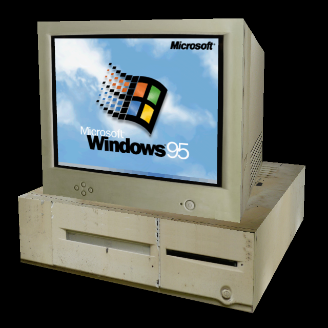

# 3D computer
This is a 3D model of a computer that you can be viewed in a browser and can run Windows 95!
You can view it [here](http://mrrar.github.io/3dcomputer/).
I made it by putting together the 3D framework THREEjs and the pc emulator PCjs.
In addition to running Windows 95 the computer can also view websites.
Just press the computer’s power button and a dialog will pop up and ask you for a URL.
Unfortunately may major websites do not work such as google.com and github.com.

